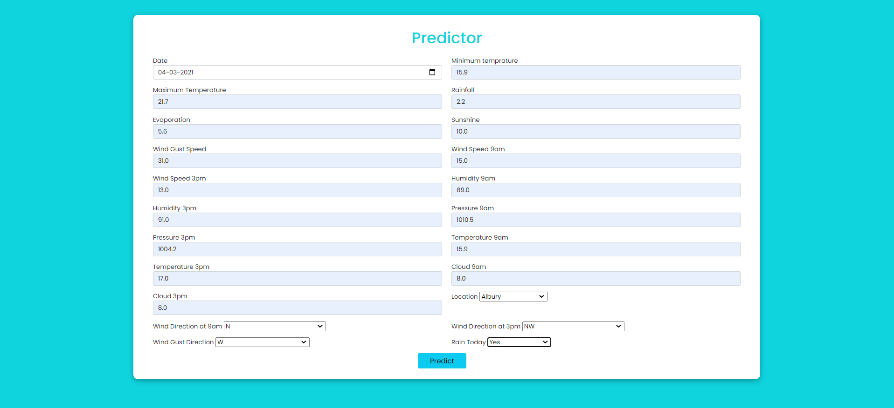
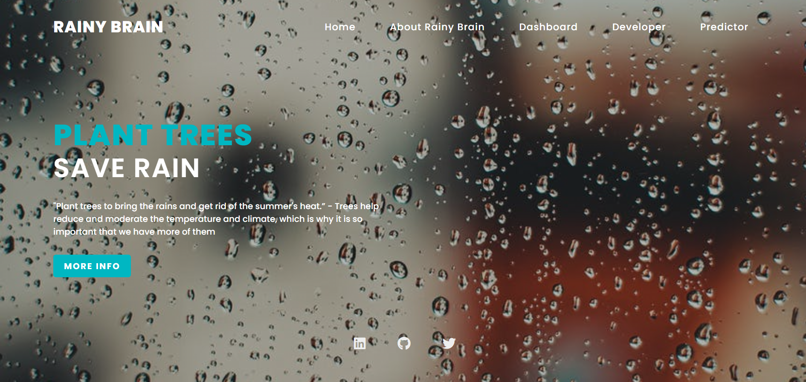
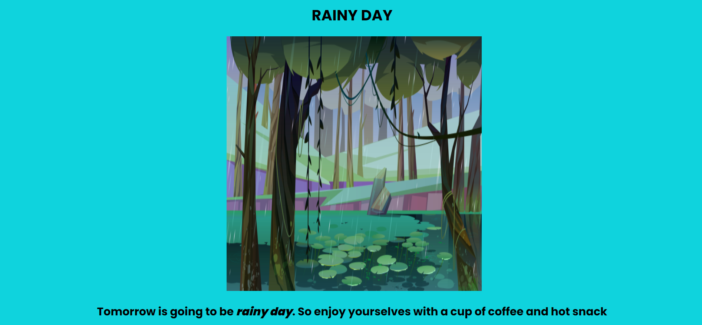

# Rain-Prediction
A project on predicting whether it will rain tomorrow or not by using the Rainfall in Australia dataset
This project is tested over lot of ml models like catboost, xgboost, random forest, support vector classifier, etc..
Out of these models catboost performed very well giving an AUC score around and ROC score of 89 far better than others.
Here due to my system compatibility is very low. So I havent done hyperparameter tuning. But it is highly recommended to do it if possible.

# Rainy Day: 

# Sunny Day:

# Tech Stack
* Front-End: HTML, CSS, Bootstrap
* Back-End: Flask
* IDE: Jupyter notebook, Pycharm

# How to run this app
* Firstly, navigate to the directory where you want to create your virtual environment using the cd command.
* cd path/to/your/project
* Create a virtual environment by using this command:
* python -m venv venv
* Activate the environment using the below command:
* .\venv\Scripts\activate
* Then install all the packages by using the following command
* pip install -r requirements.txt
* Now for the final step. Run the app:
* python app.py
* Remember to deactivate the virtual environment when you're done working on your project:
* deactivate

# Some screenshots of the app
* Landing Page:

* About Rainy Brain:

* Predictor:

* Result:

# Data Collection: 
[Rainfall Prediction in Australia dataset](https://www.kaggle.com/jsphyg/weather-dataset-rattle-package) from Kaggle
# Data Preprocessing: 
* Missing Values Handled by Random Sample imputation to maintain the variance
* Categorical Values like location, wind direction are handled by using Target guided encoding
* Outliers are handled using IQR and boxplot
* Feature Selection and was done but didnt perform well it can be seen in testing_notebook/Prediction.ipynb
* Feature Scaling didnt give a lot of difference it also can be seen in testing_notebook/RainPrediction1.ipynb
* Imbalanced Dataset was handled using SMOTE
# Model Creation:
* Different types of models were tried like catboost, random forest, logistic regression, xgboost, support vector machines, knn, naive bayes.
* Out of these catboost, random forest and support vector machines were top 3
* The conclusion were made using classification metrics. roc curve and auc score
# Model Deployment
* The model is deployed using Flask.

# I am also giving my LinkedIn profile. If you want we can connect there too
[https://www.linkedin.com/in/shaan-manchanda-808306252/](https://www.linkedin.com/in/shaan-manchanda-808306252/)
